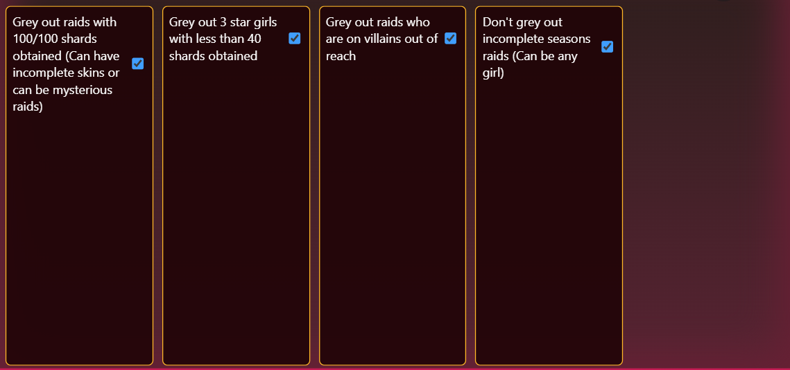
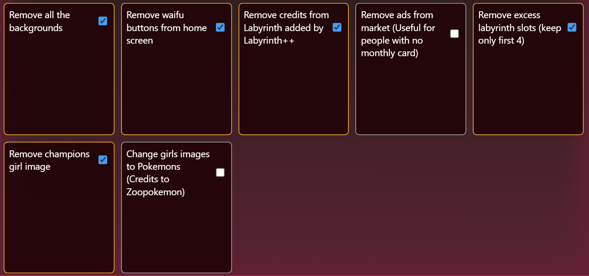

# Several Extras

## Several Raids

Adds custom filters to Raids page.

Filters include:
- Grey out raids where 100/100 shards have been collected (Incomplete skins are ignored)
- Grey out 3 star girls with less than 40 shards obtained
- Grey out raids with higher villain ID than last villain (Requires you to open the villain page of HH++ at least once after installing this script)
- DON'T grey out seasons raids (So it will show even incomplete skins or 3 star girls with less than 40 shards obtained)
- Has option to hide all greyed out raids completely (Tho Several QoL has done this one better (On the top of the raids page and easy to toggle))

### Menu Screenshot

Install from here : https://raw.githubusercontent.com/aruuush/several-extras/main/several_raids.user.js

## Several Yeets

Removes a few unnecessary things to make it less cluttered.

Removals include:
- Backgrounds from all pages
- Waifu Buttons
- Removes credits displayed in Labyrinth (Not useful if not using Labyrinth++)
- An ad from Market page which blocks part of the filter (Not useful for card holders)
- Keep only 4 slots labyrinth (Yeah kinda useless)
- Champions girl from Champions page
- Claim All button from PD page

Bonus:
- Change all girl images to Pokemons (Credits to Zoopokemon)

### Menu Screenshot

Install from here : https://raw.githubusercontent.com/aruuush/several-extras/main/several_yeets.user.js

## Several PDs

Adds persistent starring in PD. No menu. So not toggleable. Not useful if you just do 10x.

### Example Screenshot

Install from here : https://raw.githubusercontent.com/aruuush/several-extras/main/several_pds.user.js

# Requirements

You need [TamperMonkey](https://www.tampermonkey.net) or a similar browser extension.

HH++ bdsm is **required** for the script to work. Get it from [here](https://raw.githubusercontent.com/zoop0kemon/hh-plus-plus/main/dist/hh-plus-plus.user.js)
